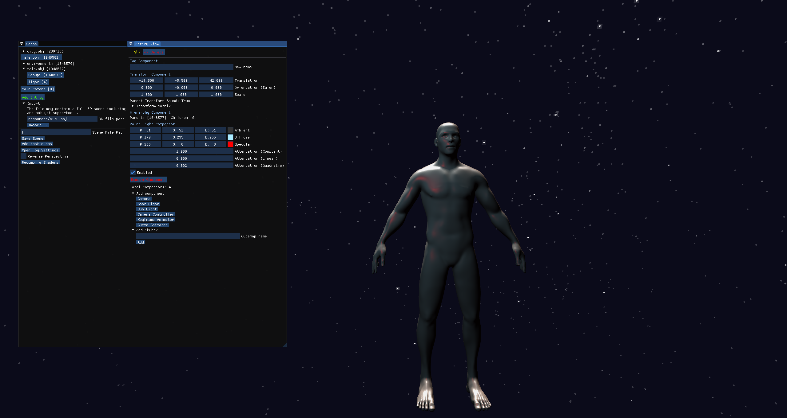

# PGREngine

A school project I did many years ago. It's a simple ECC-based (using `entt`) "engine" which exclusively uses OpenGL for rendering, with random advanced features such as (de)serialization (using `cereal`), asset import, and a quite awful editor. I would have done many things differently today, but it's still slightly impressive.



## Building the project
Building requires `conan` - a C++ package manager (which requires `python`) and `cmake`. The project will most likely not compile on Windows in it's current form, but compilation on Windows should be possible with minimal modifications.

To build the project,
```bash
# first install dependencies w/ conan:
conan install $projectdir -if $builddir --build=missing
# then run configure cmake project
cmake -S $projectdir -B $builddir
#then build the project
cd $buildir
cmake --build .
```
Unfortunately, there is no `cmake --install` support. To run the editor, use the `run_editor.sh` script located in the root of the project. 
To create a "portable" version, copy everything that is not source code from the "pgr_editor" dir along with the editor executable into a new dir. The editor uses realtive paths, so the executable has to be placed in the same dir as the "assets", "resources", and "scenes" directories.

---
## Licensing stuff
Includes skyboxes from opengameart.org:

```
"gradient" by Quinton Reeves
    CC-BY-SA 3.0 license, or any later version. Created using the gradient fill tool in GIMP.
    
"stars" by Quinton Reeves
    CC-BY-SA 3.0 license, or any later version. Created with Starbox 1.9 by Alex Grigny de Castro from the included xgStars.txt.
    Generation parameters were set to 0'N / 0'E (Sidereal: 18.299266, or 00:00 July 26th, 2008) which is Red Eclipse's birthday.

"sunsetflat" by LedIris (07/08/2009)
    ZLIB License; Four things that made this skybox; 1:Tarragen 2, 2:Me, 3:Boredom, 4:Being Sick :(
    This software is provided 'as-is', without any express or implied warranty. In no event will the authors be held liable for any damages arising from the use of this software. Permission is granted to anyone to use this software for any purpose, including commercial applications, and to alter it and redistribute it freely, subject to the following restrictions:
    * The origin of this software must not be misrepresented; you must not claim that you wrote the original software. If you use this software in a product, an acknowledgment in the product documentation would be appreciated but is not required.
    * Altered source versions must be plainly marked as such, and must not be misrepresented as being the original software.
    * This notice may not be removed or altered from any source distribution. 

"skyhigh" by Pieter Verhoeven
    CC-BY-SA 3.0 license.

"interstellar", "miramar", and "stormydays" by Jockum "hipshot" Skoglund
    hipshot@zfight.com / www.zfight.com
    Downloaded from http://opengameart.org/content/interstellar-skybox
    CC-BY 3.0
```
